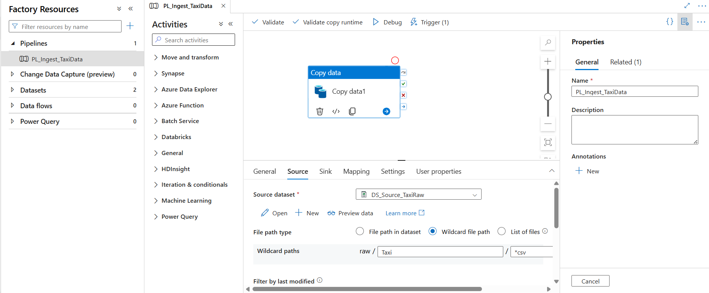
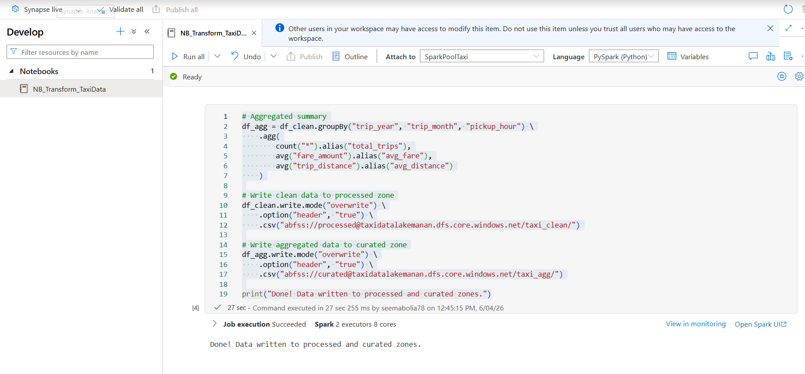
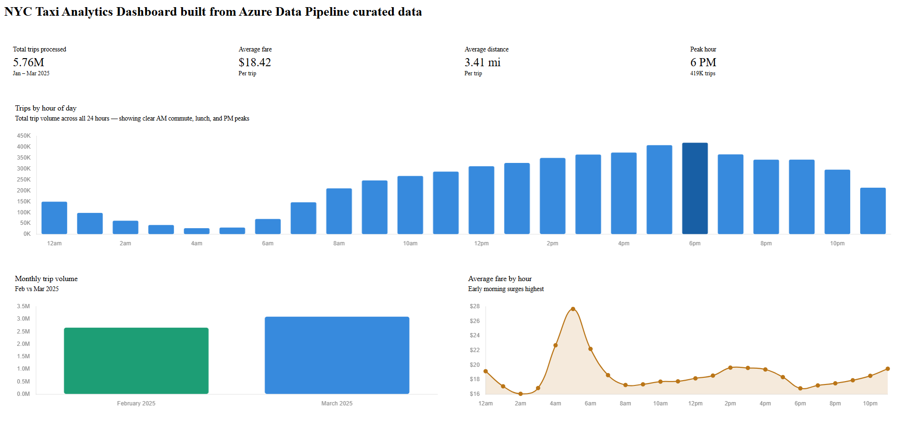

# Azure-nyc-taxi-pipeline
End-to-end cloud data pipeline built on Azure, processing 5.76M+ NYC taxi 
trips through a medallion lakehouse architecture.

## Architecture
NYC TLC Public Data
↓
Azure Data Factory (HTTP ingest + daily trigger)
↓
ADLS Gen2 — raw/Taxi/
↓
Azure Synapse Analytics (PySpark transformations)
↓
ADLS Gen2 — processed/taxi_clean/
ADLS Gen2 — curated/taxi_agg/
↓
Power BI Dashboard

## Tech Stack
| Layer | Technology |
|---|---|
| Ingestion | Azure Data Factory |
| Storage | Azure Data Lake Storage Gen2 |
| Transformation | Azure Synapse Analytics (PySpark) |
| Visualization | Power BI |
| Language | Python, PySpark, SQL |
| Version Control | Git, GitHub |

## Pipeline Overview
1. Azure Data Factory copies NYC Taxi CSV data via HTTP connector into 
   ADLS Gen2 raw zone with a daily scheduled trigger
2. PySpark notebook in Synapse reads 1M+ rows from raw zone
3. Transformations applied: null removal, outlier filtering, date parsing, 
   hourly and monthly aggregations
4. Clean data written to processed zone, aggregated data to curated zone
5. Power BI dashboard built on top of curated CSV output

## Key Results

- 5.76M trips processed across Jan–Mar 2025
- Peak hour identified: 6 PM (419K trips)
- Early morning surge: 5 AM avg fare $27.69 vs $16.05 at 2 AM
- March had 16% more trips than February

## Medallion Architecture

| Zone | Container | Description |
|---|---|---|
| Bronze | raw/Taxi/ | Raw CSV files as ingested |
| Silver | processed/taxi_clean/ | Cleaned, filtered, enriched data |
| Gold | curated/taxi_agg/ | Aggregated, analytics-ready data |

## Screenshots

## How to Run

1. Create Azure resources: ADLS Gen2, ADF, Synapse Analytics
2. Upload NYC Taxi CSV to `raw/Taxi/` container
3. Run ADF pipeline `PL_Ingest_TaxiData`
4. Execute Synapse notebook `NB_Transform_TaxiData`
5. Connect Power BI to curated CSV output
